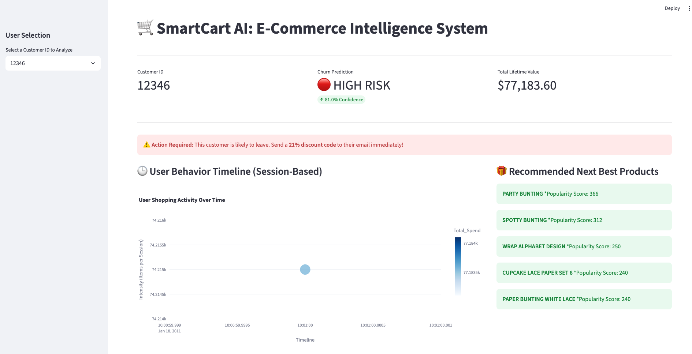
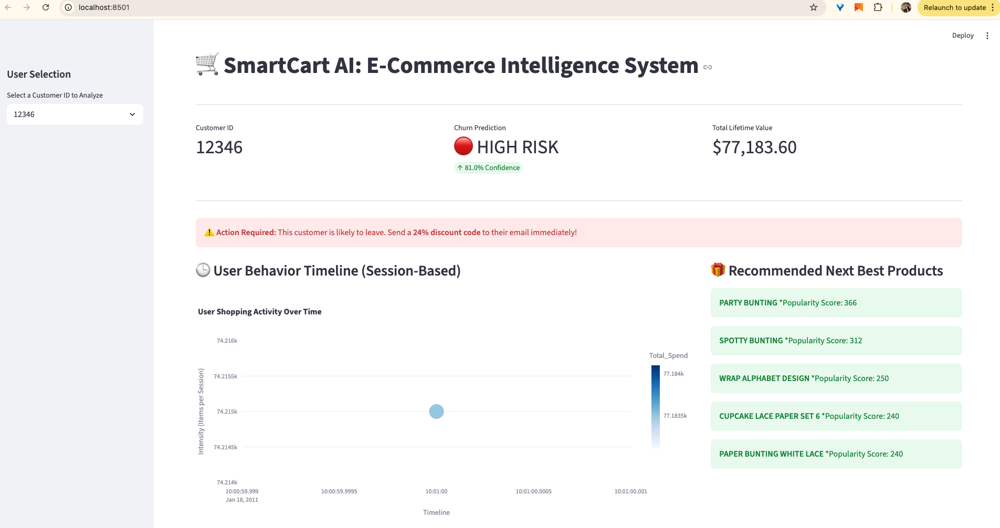
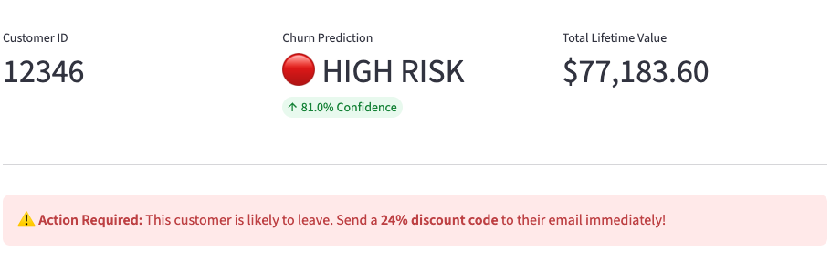
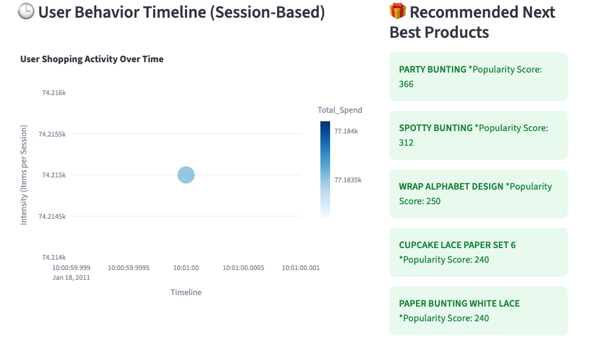

# 🛒 SmartCart AI | E-Commerce Intelligence System


[](https://www.python.org/downloads/)
[](https://streamlit.io/)
[](LICENSE)

An intelligent E-Commerce analytics system that predicts customer churn (Cart Abandonment) and generates personalized product recommendations using Machine Learning.

## 📖 Overview

Online retailers lose nearly 70% of potential revenue due to cart abandonment. **SmartCart AI** transforms raw transaction logs into actionable insights, helping businesses identify at-risk customers and re-engage them with targeted product suggestions.

### 🌟 Key Features
*   **🔮 Churn Prediction:** Classifies customers as "Loyal" or "High Risk" using a Random Forest Classifier.
*   **📈 Behavior Timeline:** Interactive visualization of shopping intensity and session history (Session-Based Analysis).
*   **🎁 Smart Recommendations:** User-based Collaborative Filtering engine to suggest the "Next Best Products."
*   **📊 Real-Time Dashboard:** A unified, interactive UI built with Streamlit.

---

## 🚀 Live Demo / Video

[](https://www.youtube.com/0tyZ6bO2QiQ)

*Click the image above to watch the demo video.*

---

## 🛠️ Tech Stack

*   **Language:** Python 3.12
*   **Data Processing:** Pandas, NumPy
*   **Machine Learning:** Scikit-Learn (Random Forest, Cosine Similarity)
*   **Visualization:** Plotly, Matplotlib
*   **Frontend:** Streamlit
*   **Model Serialization:** Joblib

---

## 📁 Project Structure

```text
SmartCart_AI/
├── .venv/                  # Virtual Environment
├── data/                   # Datasets
│   ├── raw/                # Original CSV (User must add this)
│   └── processed/          # Cleaned CSV
├── models/                 # Trained Models (.pkl files)
├── notebooks/              # Jupyter Notebooks for R&D
├── src/                    # Helper scripts
├── assets/                 # Images and Logos
├── app.py                  # Main Streamlit Application
├── requirements.txt        # Python Dependencies
└── README.md               # This file
```

---

## ⚙️ Installation & Setup

Follow these steps to run the project locally.

### 1. Clone the Repository
```bash
git clone https://github.com/mobrahi/hackathon-smartcart-ai.git
cd SmartCart_AI
```

### 2. Create Virtual Environment
**Mac/Linux:**
```bash
python3 -m venv .venv
source .venv/bin/activate
```

**Windows:**
```bash
python -m venv .venv
.venv\Scripts\activate
```

### 3. Install Dependencies
```bash
pip install -r requirements.txt
```

### 4. Prepare the Data
1.  Download the **Online Retail Dataset** (e.g., from UCI Machine Learning Repository or Kaggle).
2.  Place the CSV file inside the `data/raw/` folder and rename it to `online_retail.csv`.

### 5. Generate Models (One-time setup)
Run the provided scripts to train the models and save them to the `models/` folder.
*   Run `notebooks/01_data_cleaning.py` (or manual cleaning steps).
*   Run `notebooks/02_model_training.py` (to build the Random Forest).
*   Run `notebooks/03_recommendation_engine.py` (to build the Matrix).

*Note: Pre-trained models are included in this repo for quick demo purposes, but you can retrain them using the scripts above.*

### 6. Run the Application
```bash
streamlit run app.py
```

The application will open automatically in your browser at `http://localhost:8501`.

---

## 🧠 How It Works

### 1. Data Processing
Raw transaction data is cleaned (removing nulls, cancelled orders) and aggregated into user-level features:
*   **Recency:** Days since last purchase.
*   **Frequency:** Number of unique invoices.
*   **Monetary:** Total spend.

### 2. Abandonment Model (Random Forest)
We classify users based on their activity. If a user has `Frequency == 1`, they are labeled as "High Risk." The model learns to identify these users based on Recency and Spend patterns.

### 3. Recommendation Engine (Collaborative Filtering)
We calculate the **Cosine Similarity** between users.
*   *"Users who bought similar things in the past are likely to have similar taste in the future."*
*   We find the top 3 most similar users (neighbors) and recommend products they bought that the current user hasn't seen yet.

---

## 📸 Screenshots

### Dashboard Overview


### Risk Analysis


### Recommendations


---

## 🤝 Contributing

This project was developed for a hackathon. Contributions, issues, and feature requests are welcome!

1.  Fork the Project
2.  Create your Feature Branch (`git checkout -b feature/AmazingFeature`)
3.  Commit your Changes (`git commit -m 'Add some AmazingFeature'`)
4.  Push to the Branch (`git push origin feature/AmazingFeature`)
5.  Open a Pull Request

---

## 👥 Team

*   **[Mohd Fairuz Ibrahim]** - *Data Scientist / ML Engineer*
*   **[Mohd Fairuz Ibrahim]** - *Frontend Developer / UI Specialist*

---

## 📄 License

Distributed under the MIT License. See `LICENSE` for more information.

---

## 👨‍💻 Author

**Fairuz MFI**
- GitHub: [@mobrahi](https://github.com/mobrahi)
- Twitter: [@faairuz](https://twitter.com/faairuz)

---

## 🙏 Acknowledgments

- **E-Commerce SMEs**: Inspired by the resilience of small-to-medium enterprises and the need to democratize enterprise-level AI tools for better customer retention.

- **The Data Science Community**: Special thanks to the curators of the UCI Machine Learning Repository for providing the Online Retail Dataset that powered our model training.

- **Open Source Giants**: Built with deep gratitude for the teams behind Streamlit, Scikit-Learn, and Pandas, whose tools make rapid AI prototyping possible.

- **Hackathon Mentors**: Thanks to the organizers, mentors, lecturers and judges of NEXPERTS ACADEMY National Level AI Hackathon 2026 for providing the platform to bridge the gap between raw data and actionable business insights.

- **Personal Note**: This project was a major milestone in my journey from Python fundamentals to building functional AI applications. It represents a hands-on exploration of how predictive modeling can solve real-world revenue leakage.

---

## ⭐ Support

If you find this project helpful, please give it a ⭐ on GitHub!

---

**Made with ❤️ and Python**

